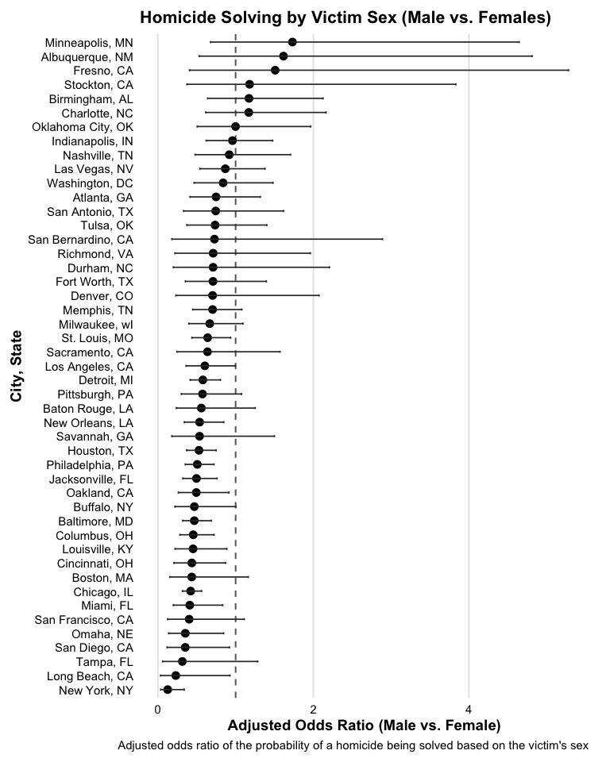
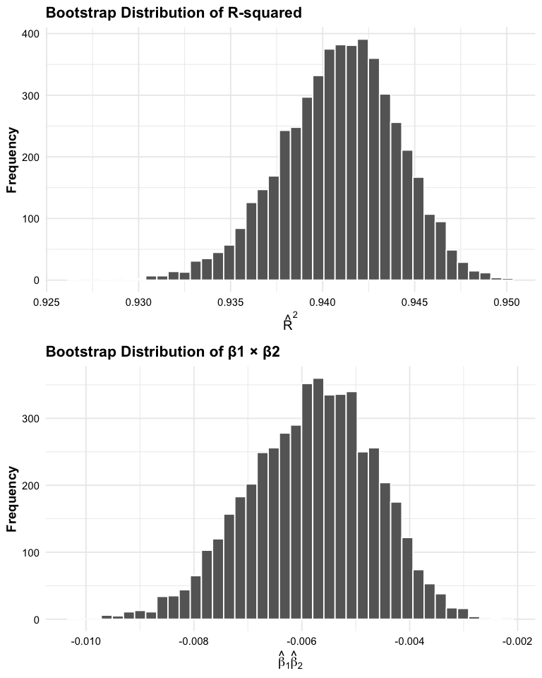

p8105_hw6_kg3006
================
Kevin Guzman
2025-11-25

## Problem 1

### Comparing solving crimes in males v. females in Baltimore, MD

In Balitmore, MD, the adjusted odds of a homicide being solved for Males
are 0.47 (95% CI: 0.32 - 0.69) times the odds for female victime,
holding all other variables constant.

### All cities

<!-- -->

Rates of homicides being solved differ by cities. The city with the
highest adjusted odds of a homicide being solved when the victim is male
compared to female is Minneapolis, MN with an adjusted odds ratio of
1.73 (95% CI: 0.68 - 4.65). The city with the lowest adjusted odds of a
homicide being solved when the victim is male compared to female is New
York, NY with an adjusted odds ratio of 0.13 (95% CI: 0.04 - 0.34).

## Problem 2

<!-- -->

The bootstrap distribution of R-squared shows that the R-squared values
fall between 0.926 and 0.95. The mean R-squared was 0.941 (95% CI:
0.934, 0.947) indicating that the model explains a substantial portion
of the variance in maximum temperature (tmax). The bootstrap
distribution of β̂₁β̂₂ ranged from-0.01 to -0.002. The mean value is
-0.006 (95% CI: -0.008, -0.004).

## Problem 3
